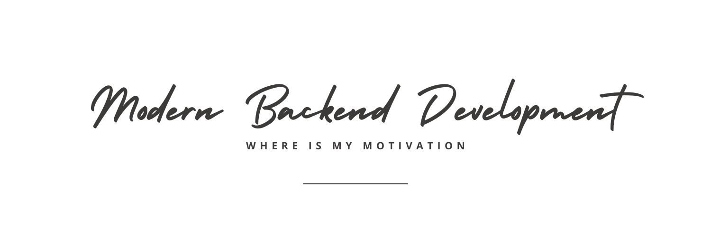

# Modern Backend Development - WhereIsMyMotivation

<!-- [](https://github.com/janishar/wimm-node-app/actions/workflows/docker_compose.yml) -->



This is a complete production ready project to learn modern techniques and approaches to build a performant and secure backend API services. It is designed for web apps, mobile apps, and other API services.

## Framework
- Nest
- Express Node
- Typescript
- Mongoose
- Mongodb
- Redis
- JsonWebToken
- Jest
- Docker
- Multer

## Highlights
- API key support
- Token based Authentication
- Role based Authorization
- Database dump auto setup
- vscode template support
- Unit Tests
- Integration Tests
- 75% plus Test Coverage
- Clean and modular codebase

## Notes
Few things are added to aid the learning process
- disk submodule is added to provide images
- database dump is added to seed the database

# About Project
WhereIsMyMotivation is a concept where you see videos and quotes that can inspire you everyday. You will get information on great personalities and make them your percieved mentors. You can also suscribe to topics of your interests. 

You can track your happiness level and write down daily journals. You can also share things of interest from web to store in your motivation box.

Using this app can bring a little bit of happiness and energy to live an inspired life.

## Android App using this backend


The Android App using on this backend is also open-sourced. You can find the project here: [Modern Android Development - WhereIsMyMotivation](https://github.com/janishar/wimm-android-app)

## API Framework Design


## Request-Response Flow
`
src → main.ts → app-module.ts → core.module.ts → apikey.guard.ts → auth.module.ts → auth.guard.ts → role.guard.ts → [feature].module.ts → [feature].controller.ts → [feature].service.ts → response.validation.ts → exception.handler.ts → response.transformer.ts
`

# Installation Instruction
vscode is the recommended editor - dark theme 

### Get the repo 
```bash
# clone repository recursively
git clone https://github.com/janishar/wimm-node-app.git --recursive
```

### Install libraries
```bash
$ npm install
```

### Run Docker Compose
- Install Docker and Docker Compose. [Find Instructions Here](https://docs.docker.com/install/).

```bash
# install and start docker containers
docker-compose up -d
```
-  You will be able to access the api from http://localhost:3000

### Run Tests
```bash
docker exec -t tester npm run test:cov
```
If having any issue
- Make sure 3000 port is not occupied else change PORT in **.env** file.
- Make sure 27017 port is not occupied else change DB_PORT in **.env** file.
- Make sure 6379 port is not occupied else change REDIS_PORT in **.env** file.

## Run on the local machine
Change the following hosts in the **.env** and **.env.test**
- DB_HOST=localhost
- REDIS_HOST=localhost

Best way to run this project is to use the vscode `Run and Debug` button. Scripts are available for debugging and template generation on vscode.

```bash
$ npm install
```

### Running the app

```bash
# development
$ npm run start

# watch mode
$ npm run start:dev

# production mode
$ npm run start:prod
```

### Test

```bash
# unit tests
$ npm run test

# e2e tests
$ npm run test:e2e

# test coverage
$ npm run test:cov
```

## API DOC
[](https://documenter.getpostman.com/view/1552895/2s9YymH5MR)

## Minimalistic version of this project
If you want to use plain Express.js to create the same project explore the Minimalistic version of this project

[Minimalistic Backend Development - WhereIsMyMotivation](https://github.com/janishar/wimm-node-app-minimalistic)

## Find this project useful ? :heart:
* Support it by clicking the :star: button on the upper right of this page. :v:

## More on YouTube channel - Unusual Code
Subscribe to the YouTube channel `UnusualCode` for understanding the concepts used in this project:

[](https://www.youtube.com/@unusualcode)

## Contribution
Please feel free to fork it and open a PR.
